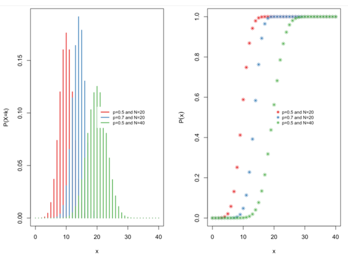
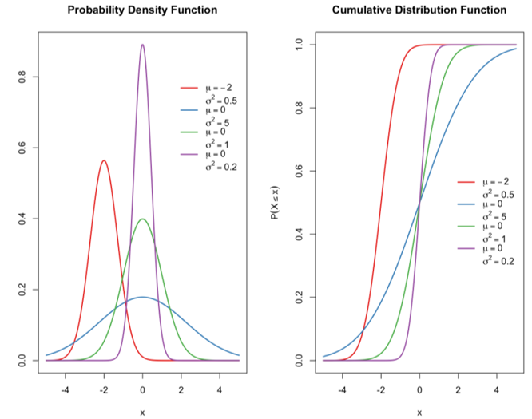

```{r setup, include = FALSE}
library(knitr)                              # paquete que trae funciones utiles para R Markdown
library(tidyverse)                          # paquete que trae varios paquetes comunes en el tidyverse
library(datos)                              # paquete que viene con datos populares traducidos al español :)
library(shiny)
# opciones predeterminadas
knitr::opts_chunk$set(echo = FALSE,         # FALSE: los bloques de código NO se muestran
                      dpi = 300,            # asegura gráficos de alta resolución
                      warning = FALSE,      # los mensajes de advertencia NO se muestran
                      error = FALSE)        # los mensajes de error NO se muestran


options(htmltools.dir.version = FALSE)
```

class: inverse, left, bottom
background-image: url("img/back1.jpg")
background-size: cover


# **`r rmarkdown::metadata$title`**
----

## **`r rmarkdown::metadata$subtitle`**

### `r rmarkdown::metadata$author`
### `r rmarkdown::metadata$date`

```{r xaringanExtra-share-again, echo=FALSE}
xaringanExtra::use_share_again()
```

```{r xaringanExtra-clipboard, echo=FALSE}
xaringanExtra::use_clipboard()
```

---
name: hola
class: inverse, middle, center


# Pontificia Universidad Javeriana de Cali

--

## Maestría en Política Social
---


.pull-left[

<br><br><br><br><br>

```{r echo=FALSE, out.width = "110%" }
knitr::include_graphics("img/gif1.gif")
```
]

<br><br><br><br><br>


.pull-right[
# Orlando Joaqui-Barandica
### [www.joaquibarandica.com](https://www.joaquibarandica.com)
 *PhD. Student in Industrial Engineering* 
 
 *MSc. Applied Economics*
 
 *BSc. Statistics*
]


---


name: menu
background-image: url("img/back2.jpg")
background-size: cover
class: left, middle, inverse

# Contenido

----


.pull-left[
### `r icon("dice-d6")` [Distribuciones en R](#Distri)

### `r icon("dice-d6")` [Distr. Binomial](#Binom)

### `r icon("dice-d6")` [Actividad Binomial](#ActBinom)
]


.pull-right[
### `r icon("dice-d6")` [Distr. Normal](#Normal)

### `r icon("dice-d6")` [Actividad Normal](#ActNormal)

### `r icon("dice-d6")` [Teorema Central del Límite](#TCL)
]

---

name: Distri


# Distribución de probabilidad

El paquete `stats` de R (que se instala por defecto al instalar R, y se carga en memoria siempre que iniciamos sesión) implementa numerosas funciones para la realización de cálculos asociados a distintas distribuciones de probabilidad. Entre las utilizadas más comunmente son:


.pull-left[

### Distribuciones Discretas

**Distribución** *(Nombre en R)*
* Binomial (`binom`)
* Poisson (`pois`)
* Geométrica (`geom`)
* Hipergeométrica (`hyper`)
* Binomial Negativa (`nbinom`)


]


.pull-right[

### Distribuciones Continuas

**Distribución** *(Nombre en R)*
* Uniforme (`unif`)
* Normal (`norm`)
* t Student (`t`)
* F Fisher (`F`)
* Chi-Cuadrado (`chisq`)
* Exponencial (`exp`)
* Gamma (`gamma`)
* Weibull (`weibull`)
* W de Wilcoxon (`wilcox`)


]


---


# Distribución de probabilidad

Ejecutando: `help(Distributions)`

Muestra el listado de distribuciones de probabilidad disponibles en el paquete `stats`. Otras distribuciones están disponibles en otros paquetes.

<br>

Para cada distribución, R dispone de cuatro funciones. Se puede acceder a cada una de ellas simplemente precediendo el nombre de la distribución que figura en la tabla anterior por la letra que se indica a continuación:

* **d:** función de densidad o de probabilidad.
* **p:** función de distribución
* **q:** función para el cálculo de cuantiles.
* **r:** función para simular datos con dicha distribución.


<br>

Así, por ejemplo, para la distribución normal, la función de densidad se obtiene como `dnorm()`, la función de distribución como `pnorm()`, los cuantiles se calculan mediante `qnorm()` y se pueden generar valores aleatorios con distribución normal mediante `rnorm()`. Puede consultarse la ayuda, `help(dnorm)` para conocer la sintaxis específica de estas funciones.


---

name: Binom

# Distribución de probabilidad

## Distribución Binomial

La distribución binomial es una distribución de probabilidad discreta. Describe el resultado de ensayos independientes de **n** en un experimento. Se supone que cada ensayo tiene sólo dos resultados, ya sea éxito o fracaso. Si la probabilidad de un ensayo exitoso es de **p**, entonces la probabilidad de tener resultados exitosos de **k** en un experimento de ensayos independientes de **n** es dada por la probabilidad de la función de masa:

$$
f(k, n, p) = P(X=k) = {n \choose k}p^k(1-p)^{n-k} \quad \quad \quad ; \quad k = 0, 1, 2, ..., n
$$
con media $np$ y varianza $np(1-p)$


Si $X$ sigue una distribución binomial $B(n,p)$, entonces:

* $P(X = k) =$ `dbinom(k,n,p)`
* $P(X \leq k) =$ `dbinom(k,n,p)`
* $q_a = min {x: P(X \leq x) \geq a }$ = q(a,n,p)
* `rbinom(m,n,p)` genera $m$ valores aleatorios con esta distribución


---

# Distribución de probabilidad

## Distribución Binomial

.center[



]

---


# Distribución de probabilidad

## Distribución Binomial

### Ejercicio

Suponga que hay doce preguntas de opción múltiple en un examen de matemáticas. Cada pregunta tiene cinco posibles respuestas, y sólo una de ellas es correcta. Encuentre la probabilidad de tener cuatro o menos respuestas correctas si un estudiante intenta responder a cada pregunta al azar.


--

### Solución

Dado que sólo una de cada cinco respuestas posibles es correcta, la probabilidad de responder correctamente una pregunta al azar es de $1/5 = 0.2$. Podemos encontrar la probabilidad de tener exactamente 4 respuestas correctas por intentos aleatorios de la siguiente manera.


``` r 

p = 1/5
n = 12
k = 4

dbinom(k, n, p)

```


---


# Distribución de probabilidad

## Distribución Binomial

### Ejercicio


Para encontrar la probabilidad de tener cuatro o menos respuestas correctas mediante intentos aleatorios, aplicamos la función de distribución acumulada `pbinom`

``` r
pbinom(4,size=n,prob=0.2)
```

**Solución:** La probabilidad de que cuatro o menos preguntas sean contestadas correctamente al azar en un cuestionario de opción múltiple de doce preguntas es del 92,7%.

--

<br>

### Pregunta:

¿Cuál es la probabilidad de que 2 ó 3 preguntas sean respondidas correctamente?


---


name: ActBinom
class: inverse, center, middle

# `r icon("sort-numeric-up")`
# Actividad
----

.right[
.bottom[
####  [`r icon("bell")`](#menu)
]
]


En grupo desarrollar los siguientes puntos y posteriormente discutirlos en clase. Cada grupo presentará su razonamiento para desarrollar los puntos propuestos.


---


class: inverse
background-color: #A93226


.pull-left[


# Punto 1

Las tendencias depresivas en infantes (Menores de 10 años) se presentan en 7 de cada 1000 menores. Hallar la probabilidad de que al examinar 50 menores sólo haya uno con síntomas de depresión. 


]


.pull-right[

# Punto 2

La probabilidad de éxito de un determinado esquema terapéutico es 0,72. Calcular la probabilidad de que una vez intervenidos 15 pacientes: 

**a)** Todos sean declarados exitoso 

**b)** Ninguno sea declarado exitoso 

**c)** Trece de ellos sean declarados exitosos 


]


---


class: inverse
background-color: #A93226


.pull-left[


# Punto 3

La probabilidad de que un paciente se recupere de un duelo por la pérdida de un pariente en primer grado de consanguinidad es 0.4., 15 personas han sido intervenidas como pacientes por perdida de una pariente de grado de consanguinidad 1.

**a)** ¿Cuál es la probabilidad de que al menos 10 se recuperen? 

**b)** ¿Cuál es la probabilidad de entre 3 y 8 pacientes se recuperen? 


]


.pull-right[

# Punto 4

En ciudad la necesidad de dinero para comprar drogas se establece como la razón del 75% de los robos. Encuentre la probabilidad de que entre los siguientes cinco casos de robo: 

Robo por droga = 0,75; 
Robo por otra causa = 0.25;
N=15 

**a)** Dos resulten de la necesidad de dinero para comprar drogas. 

**b)** Al menos tres resulten de la necesidad de dinero para comprar drogas. 


]


---

class: inverse
background-color: #A93226


# Punto 5


.pull-left[

De acuerdo con un estudio publicado por un grupo de sociólogos de la Universidad de  Massachussets aproximadamente el 30% de los consumidores de Valium en el estado de Massachussets tomaron Valium por primera vez debido a problemas psicológicos. Encuentre la probabilidad de que en un grupo de ocho sujetos con problemas psicológicos:


**a)** Tres comenzaron a tomar Valium por problemas psicológicos. 

**b)** Al menos cinco comenzaron a consumir Valium por problemas que no fueron psicológicos. 

**c)** No más de 5 comenzaran a consumir por primera vez Valium. 

]

.pull-right[


]

---

name: Normal

# Distribución de probabilidad

## Distribución Normal


La función de densidad de probabilidad de la distribución Normal es:

$$
f(x) = \frac{1}{\sqrt{2\sigma^2 \pi}}e^{- \frac{(x-\mu)^2} {2\sigma^2}}
$$

* $\mu$ es la media de la distribución
* $\sigma$ es la desviación estándar $(\sigma > 0)$
* $\sigma^2$


El proceso para la estandarización consiste en transformar la variable Normal $N(\mu, \sigma)$ en $N(0, 1)$


$$
Z = \frac{X - \mu}{\sigma} \sim N(0,1)
$$


---


# Distribución de probabilidad

## Distribución Normal

.center[



]

---


# Distribución de probabilidad

## Distribución Normal

### Ejercicio

$X$ es una variable normalmente distribuida con una media de $\mu = 30$ y una desviación estándar de $\sigma = 4$. Encontrar:

**a.** $P(x < 40) \quad \quad$ **b.** $P(x > 21) \quad \quad$ **c.** $P(30 < x < 35)$

--

### Solución

a. `pnorm(40, mean = 30, sd = 4, lower.tail = TRUE)`

b. `pnorm(21,mean=30,sd=4,lower.tail = FALSE)`

c. `pnorm(35,mean=30,sd=4,lower.tail = TRUE) - pnorm(30,mean=30,sd=4,lower.tail = TRUE)`


---


# Distribución de probabilidad

## Distribución Normal

### Ejercicio


El ingreso a una determinada universidad se determina mediante un examen nacional. Los resultados de esta prueba se distribuyen normalmente con una media de 500 y una desviación estándar de 100. Tom quiere ser admitido en esta universidad y sabe que debe obtener mejores resultados que al menos el 70% de los estudiantes que tomaron el examen. Tom toma el examen y saca 585 puntos. ¿Será admitido en esta universidad?


``` r 

N = 1000
hist(rnorm(N,500,100),20,col="grey")
abline(v=585,col=2)

```
--

### Solución


`pnorm(585,mean=500,sd=100)` **Interpretación:** Tom obtuvo una puntuación mejor que el 80.23% de los estudiantes que tomaron el examen y será admitido en esta universidad.


---


name: ActNormal
class: inverse, center, middle

# `r icon("sort-numeric-up")`
# Actividad
----

.right[
.bottom[
####  [`r icon("bell")`](#menu)
]
]


En grupo desarrollar los siguientes puntos y posteriormente discutirlos en clase. Cada grupo presentará su razonamiento para desarrollar los puntos propuestos.


---


class: inverse
background-color: #A93226


.pull-left[


# Punto 1

Determine el valor de la normal estándar Z para el área indicada.

<br>

**a)** Debajo de este valor Z están el 90% de los valores de Z. 

**b)** El 80% de los valores está a la derecha de este valor Z. 

**c)** El 30% de los valores se encuentra a la izquierda de este valor Z. 

**d)** El 10% de los valores es mayor que este valor Z. 

**e)** El 70% de los valores es menor que este valor Z. 


]


.pull-right[


]


---


class: inverse
background-color: #A93226


# Punto 2

Se investiga la relación entre varias condiciones socioeconòmicas y el comportamiento apostador en adolescentes y adultos jóvenes. Para duplicar los resultados, usted debe obtener datos de una muestra de adultos jóvenes con una edad media de 22 años y una desviación estándar de 2 años. Las edades de esta población están normalmente distribuidas, debe seleccionar una persona al azar y calcular las siguientes probabilidades. Trace la curva de la normal para cada caso y resalte el área que representa dicha probabilidad. 

<br>

**a)** La probabilidad de seleccionar al azar a alguien entre las edades de 20 y 24 años 

**b)** La probabilidad de seleccionar al azar con 19 años o menos 

**c)** Si al 10% más joven de la población de adultos jóvenes se le enviara una carta ¿A qué edad deben dirigirse las cartas? 

**d)** Se ha determinado que un grupo especial de individuos son aquellos que presentan edades superiores a 25 años, ¿Qué probabilidad existe de seleccionar al azar una persona del grupo especial? 


---


class: inverse
background-color: #A93226


# Punto 3

Se examinaron las respuestas de pacientes a un tratamiento antidepresivo en una clínica de salud mental comunitaria. La escala de Depresión del Centro de Estudios Epidemiológicos (CESD) es usada para evaluar la severidad de los síntomas depresivos. Supongamos que tiene puntuaciones CESD normalmente distribuídas para algunos pacientes de salud mental. La puntuación CESD media es 27.2 puntos en la escala con una desviación estándar de 3.2. Su interés es en aislar puntuaciones CESD extremadamente bajas y altas para estos pacientes, aquellos que caen fuera del 95% medio de las puntuaciones. Estas áreas caerán en las colas de la curva normal con 2.5% en cada cola. 

<br>

**a)** Identifique las regiones extremadamente bajas y altas, determinando las puntuaciones CESD que definen los extremos fuera del área media del 95%. Interprete su respuesta. 

**b)** Los pacientes con puntuaciones mayores a 34.2 se clasifican como pacientes en riesgo de hacerse daño a sí mismos. ¿Qué probabilidad existe de encontrar un paciente en riesgo? 

**c)** Se han seleccionado 5 pacientes en una muestra, ¿qué probabilidad existe de exactamente 2 pacientes estén en riesgo de hacerse daño a sí mismos? 


---

class: inverse
background-color: #A93226


# Punto 4

Una prueba estandarizada de uso común es la Escala de Inteligencia de Standford-Binet. Esta prueba está diseñada para evaluar el desarrollo cognitivo en niños. La prueba está normalizada y diseñada tal que las puntuaciones caen en una distribución normal respecto a una media de 100 puntos en la escala con una desviación de 13 puntos en la escala. 

<br>

**a)** Suponga que una persona se sometió a la prueba, ¿Cuál es la probabilidad de tener una puntuación menor a 130 puntos? 

**b)** ¿Cuál es la probabilidad de que una persona obtenga puntajes entre 89 y 115? 

**c)** Si se ha determinado que puntajes inferiores a 85 presentan bajo desarrollo cognitivo, y actualmente se ha seleccionado una muestra de 10 pacientes, ¿Cuál es la probabilidad de que máximo dos pacientes de la muestra de 10 presenten bajo desarrollo cognitivo? 


---

class: inverse
background-color: #A93226


# Punto 5

Usted investiga aspectos de desnutrición en el sector educativo. La media de los pesos de 500 estudiantes de un colegio es 70 kg. Se ha determinado que la probabilidad de encontrar a un estudiante que pese menos de 64 kg es de 0.021. Asuma que los pesos distribuyen normalmente. 

<br>

**a)** Determine aproximadamente cuántos estudiantes pesan entre 60 kg y 75 kg 

**b)** Determine aproximadamente cuántos estudiantes pesan más de 90 kg 

**c)** Si deben elegirse el 10% de estudiantes con mayor peso para realizar una actividad, ¿a partir de que peso se eligen los estudiantes? 


---


name: TCL

# Teorema Central del Límite

### ¿Cuántos minutos gasta para ir a la institución a la que asiste?

.scroll-box-20[
``` r


library(haven)

Educ = read_dta("G:/Mi unidad/Clases/Javeriana/2021-2/Educación.dta")

# Histograma de ¿Cuántos minutos gasta para ir a la institución a la que asiste?
hist(Educ$P6167)

Y = na.omit(Educ$P6167)

hist(Y)

#En promedio se demoran 18.3 minutos a la escuela o colegio
mean(Y)


#Saquemos una muestra de 10 personas

muestra = sample(Y,10)
mean(muestra)


# Que pasa si la muestra es de 100 personas

muestra = sample(Y,100)
mean(muestra)


# Y si sacamos 10000 muestras de 1000 personas

muestra <- 0

for(i in 1:10000){
  
  muestra[i] = mean(sample(Y,1000))
    
}

hist(muestra)

```
]


---


class: inverse, center, middle
background-color: #00081d

.pull-left[

.center[
<br><br>

# Gracias!!!

<br><br><br><br><br>


### ¿Preguntas?
]


]


.pull-right[


### [www.joaquibarandica.com](https://www.joaquibarandica.com)
`r icon("twitter")` jotajb5

`r icon("github")` juniorjb5

`r icon("envelope")` orlando.joaqui@javerianacali.edu.co

]


<br><br><br>

----

*Las imágenes utilizadas para ambientar la presentación son de [pixabay](https://pixabay.com/).*  
Sources: [R for the Rest of Us](https://rfortherestofus.com/), Rob Kabacoff


